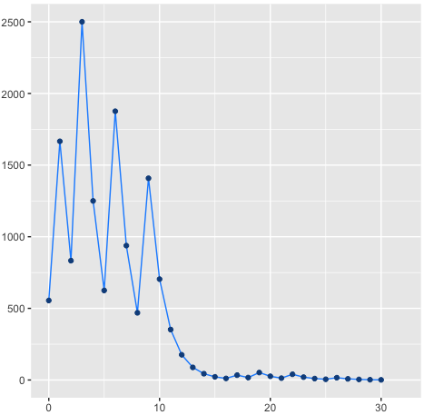

# RShiny_Syracuse
The provided code consists of a simple explanation and visualization of the "syracuse conjecture", also known as "Collatz conjecture", named after Lothar Collatz. For more information on this simple but yet unsolved mathematical problem check [Wikipedia]([https://link-url-here.org](https://en.wikipedia.org/wiki/Collatz_conjecture)https://en.wikipedia.org/wiki/Collatz_conjecture). 

